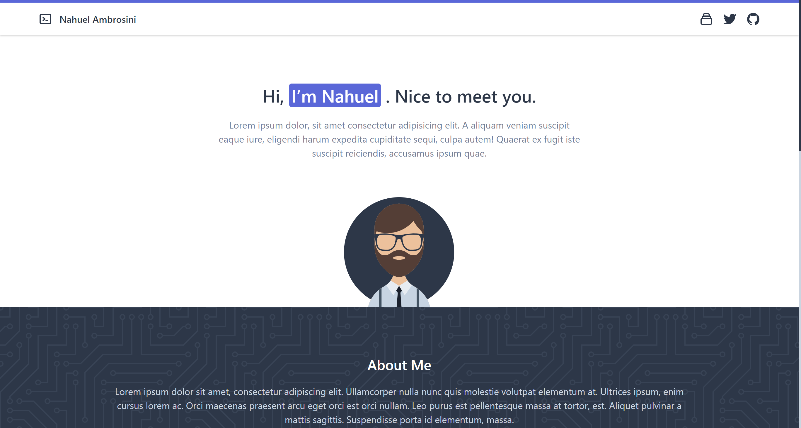

# Starter App - Vue.js with Tailwind




## Credits

Tutorial adapted from this [great post](https://dev.to/vonagedev/using-tailwind-css-with-vue-js-b1b) 

## Project setup
```
npm install
```

### Compiles and hot-reloads for development
```
npm run serve
```

### Compiles and minifies for production
```
npm run build
```

### Lints and fixes files
```
npm run lint
```