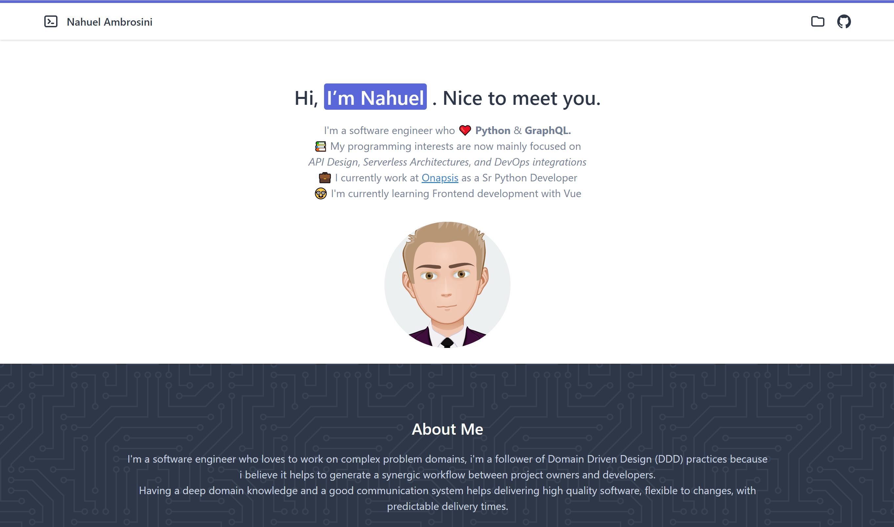

# Starter App - Vue.js with Tailwind



[✨ Demo](https://dreamy-lumiere-c0033c.netlify.app/)

## Credits

Tutorial started from this [great post](https://dev.to/vonagedev/using-tailwind-css-with-vue-js-b1b)
Using templates from [here](https://tailwindcomponents.com/component/developer-portfolio) and [here](https://github.com/tailwindtoolbox/Ghostwind)

## TODO
 [x] Create Header and Footer vue components
 [x] Implement internationalization (Spanish + English)
 [x] Enable dark mode
 [ ] Migrate posts data to use graphql+strawberry (django? flask?)

## Improvements
 [x] Fine-tune site performance with lighthouse - Score of 95+
 [x] Add call to action below profile pic (and social network badges?)
 [x] Auto detect user language and adjust accordingly
 [x] Make header sticky
 [ ] Make lead page fit the full screen *on-mobile* but not on bigger media sizes
 [ ] Add accesibility tool (lighthouse?) to CI workflow
 [ ] Move repetead elements to subcomponents (icons, article layout, etc)
 [ ] Use flag svgs instead of emojis to have consistent ui over different fonts on language switcher


## Hacks
 [ ] Replace margin with div and border bottom to create extended space with background color


## Project setup
Install nvm to manage node & npm versions
```
curl -o- https://raw.githubusercontent.com/nvm-sh/nvm/v0.37.2/install.sh | bash
nvm install node
```
>Tested with `node v15.8.0` and `npm 7.5.1`

```
npm install
```

### Compiles and hot-reloads for development
```
npm run serve
```

### Compiles and minifies for production
```
npm run build
```

### Lints and fixes files
```
npm run lint
```